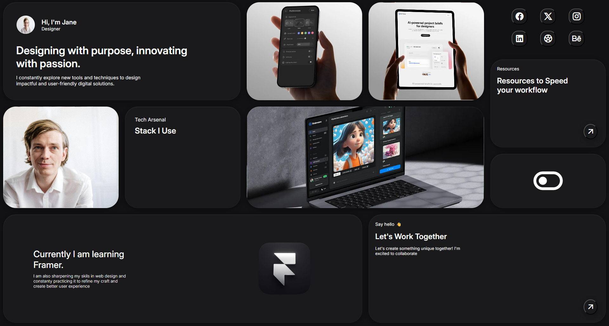

# Bento Dashboard - Static Layout

A static Bento-style dashboard interface built as a assignment for **Sheryians Coding School Cohort 3.0**.

## 🛠️ Technical Implementation

This project was assigned to master structural layout techniques using raw CSS without external frameworks.

* **Layout:** Utilized **CSS Grid** to define the structural Bento-box placement and **Flexbox** for internal component alignment.
* **Element Positioning:** Employed custom CSS positioning properties to handle specific card layerings and offsets.

---

## 💻 Tech Stack
- **HTML5:** Semantic architecture.
- **CSS3:** Advanced Grid, Flexbox, and manual positioning logic.

---
